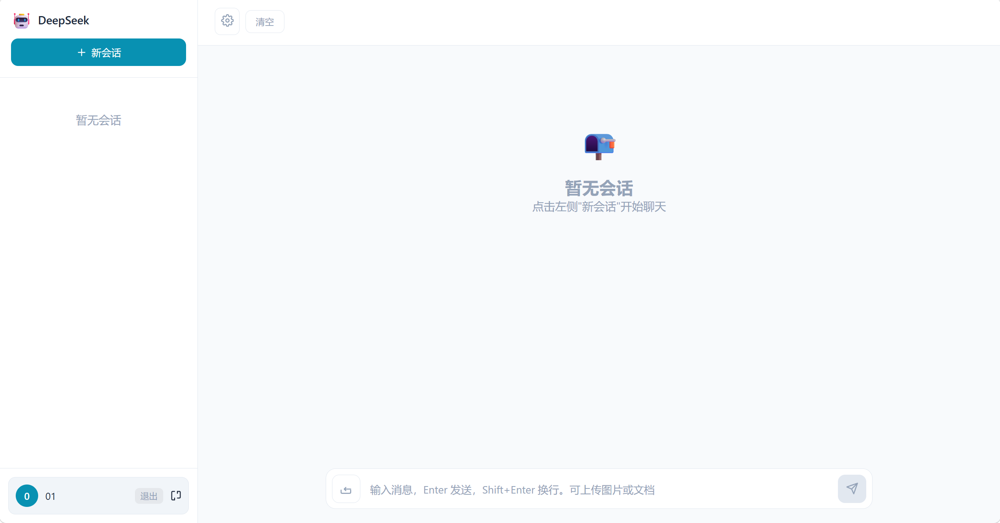

<div align="center">

# 🤖 DeepSeek 智能聊天助手

### 基于 DeepSeek V4 大模型的全栈 AI 对话应用

[](https://github.com/springCreate/chatbot/stargazers)
[](https://github.com/springCreate/chatbot/network/members)
[](https://github.com/springCreate/chatbot/issues)
[](https://opensource.org/licenses/MIT)


**流式输出 · 文件解析 · 图片 OCR · 多轮对话 · 用户认证 · 响应式设计**

</div>

<br>

<p align="center">
  <a href="#-功能特性">✨ 功能特性</a> ·
  <a href="#-界面预览">🎨 预览</a> ·
  <a href="#-技术栈">🛠️ 技术栈</a> ·
  <a href="#-快速开始">🚀 快速开始</a> ·
  <a href="#-项目结构">📁 结构</a> ·
  <a href="#-api-接口">🔌 API</a> ·
  <a href="#-常见问题">❓ FAQ</a> ·
  <a href="docs/PRD.md">📋 PRD</a>
</p>

<br>

## ✨ 功能特性

<table>
<tr>
<td width="50%" valign="top">

### 🤖 智能对话
- 接入 **DeepSeek-V4 Pro / Flash** 模型
- **SSE 流式输出**，逐字显示，响应迅速
- 完整上下文记忆，支持连续追问
- 自定义系统提示词与温度参数
- **流式中断清理**，停止后自动移除半条消息

</td>
<td width="50%" valign="top">

### 📄 文件处理
- 支持 **PDF / Word / Excel / TXT / Markdown**
- 自动提取文档文本内容
- docx 文件同步提取内嵌图片
- 文件内容按需注入上下文（节省 Token）

</td>
</tr>
<tr>
<td width="50%" valign="top">

### 🖼️ 图片 OCR
- 基于 **Tesseract.js** 本地识别
- 支持中英文混合文字识别
- 支持 PNG / JPG / JPEG / GIF / WebP / BMP
- 无需第三方云服务，隐私安全

</td>
<td width="50%" valign="top">

### 🔐 安全认证
- **JWT** 令牌认证 + **bcryptjs** 密码加密
- 用户注册 / 登录系统
- 会话数据按用户隔离，互不干扰
- 中文错误提示，体验友好

</td>
</tr>
<tr>
<td width="50%" valign="top">

### 📝 内容渲染
- **Markdown** 完整渲染（表格/列表/引用）
- 代码块语法高亮（highlight.js）
- 支持行内代码、链接、图片
- 数学公式与流程图友好展示

</td>
<td width="50%" valign="top">

### 📁 会话管理
- 多会话创建、重命名、删除
- 消息持久化存储，刷新不丢失
- 会话列表侧边栏快速切换
- **危险操作二次确认**（清空/删除防误触）

</td>
</tr>
<tr>
<td width="50%" valign="top">

### 💬 消息操作
- **一键复制** AI 回答（含剪贴板降级方案）
- **重新生成** 最近一条 AI 回答
- 桌面 hover 显示、移动端常驻
- 复制成功 2 秒反馈态

</td>
<td width="50%" valign="top">

### 🛡️ 工程细节
- 流式中断后自动清理脏数据
- 二次确认 3 秒超时自动恢复
- 组件卸载清理定时器
- 会话切换重置确认态，避免污染

</td>
</tr>
<tr>
<td colspan="2" align="center">

### 📱 响应式 & 🌙 主题
**桌面 / 平板 / 移动端** 自适应布局 · **暗色 / 亮色** 主题自由切换 · 现代 UI 设计

</td>
</tr>
</table>

<br>

## 🎨 界面预览



<br>

## 🛠️ 技术栈

<table>
<thead>
<tr>
<th width="120" align="left">🔧 层级</th>
<th align="left">📦 技术</th>
<th width="100" align="center">📋 版本</th>
</tr>
</thead>
<tbody>
<tr><td><b>前端框架</b></td><td>Vue 3 (Composition API)</td><td align="center">3.x</td></tr>
<tr><td><b>构建工具</b></td><td>Vite</td><td align="center">5.x</td></tr>
<tr><td><b>后端服务</b></td><td>Node.js + Express</td><td align="center">18+</td></tr>
<tr><td><b>AI 模型</b></td><td>DeepSeek API (V4 Pro/Flash)</td><td align="center">V4</td></tr>
<tr><td><b>认证方案</b></td><td>JWT + bcryptjs</td><td align="center">-</td></tr>
<tr><td><b>内容渲染</b></td><td>marked + highlight.js</td><td align="center">-</td></tr>
<tr><td><b>OCR 识别</b></td><td>Tesseract.js</td><td align="center">-</td></tr>
<tr><td><b>文件解析</b></td><td>pdf-parse / mammoth / xlsx / docx</td><td align="center">-</td></tr>
<tr><td><b>数据存储</b></td><td>JSON 文件 (db.json)</td><td align="center">-</td></tr>
</tbody>
</table>

<br>

## 🚀 快速开始

> 📌 **前置条件**：需要 [DeepSeek API Key](https://platform.deepseek.com/)，请先申请并复制备用。

### 步骤 1 · 克隆仓库

```bash
git clone https://github.com/springCreate/chatbot.git
cd chatbot
```

### 步骤 2 · 配置环境变量

<details>
<summary>📖 点击展开配置详情</summary>

```bash
# Windows
copy server\.env.example server\.env

# macOS / Linux
cp server/.env.example server/.env
```

编辑 `server/.env`，填入你的 DeepSeek API Key：

```env
# DeepSeek API 密钥（必填）
DEEPSEEK_API_KEY=sk-your-key-here

# 服务端口（可选，默认 3000）
PORT=3000

# JWT 签名密钥（生产环境请修改）
JWT_SECRET=chatbot-secret-key-2024

# 数据持久化目录（可选，默认使用系统临时目录）
# DATA_DIR=./data
```

</details>

### 步骤 3 · 安装依赖

```bash
npm run install:all
```

### 步骤 4 · 启动开发服务

需要**同时启动两个终端**：

| 终端 | 命令 | 说明 | 访问地址 |
|:---:|------|------|------|
| 1️⃣ | `npm run dev:server` | 启动后端服务 | http://localhost:3000 |
| 2️⃣ | `npm run dev:client` | 启动前端开发服务 | http://localhost:5173 |

> 💡 **提示**：前端 Vite 开发服务器会自动将 `/api` 请求代理到后端（3000 端口），请访问 **http://localhost:5173** 使用应用。

### 步骤 5 · 生产构建

```bash
npm run build   # 构建前端静态文件
npm start       # 启动生产服务
```

浏览器打开 **http://localhost:3000** 即可使用。

<br>

## 📁 项目结构

```
chatbot/
├── server/                          # 🔌 Express 后端
│   ├── index.js                     #    服务入口（API + 流式代理 + 文件解析 + 认证）
│   ├── package.json
│   ├── .env                         #    环境变量（不提交 Git）
│   └── .env.example                 #    配置模板
│
├── client/                          # 🎨 Vue 3 前端
│   ├── src/
│   │   ├── components/              #    组件目录
│   │   │   ├── Chat.vue             #      聊天主界面
│   │   │   ├── ChatInput.vue        #      输入框组件
│   │   │   ├── ChatMessage.vue      #      消息渲染组件
│   │   │   ├── Login.vue            #      登录/注册组件
│   │   │   ├── SessionList.vue      #      会话列表侧边栏
│   │   │   └── SettingsPanel.vue    #      设置面板
│   │   ├── composables/
│   │   │   └── useChat.js           #    核心逻辑（Auth/Sessions/Upload）
│   │   ├── utils/
│   │   │   ├── markdown.js          #    Markdown 渲染工具
│   │   │   └── ocr.js               #    OCR 识别工具
│   │   ├── App.vue                  #    根组件
│   │   ├── main.js                  #    入口文件
│   │   └── style.css                #    全局样式
│   ├── index.html
│   ├── package.json
│   └── vite.config.js               #    Vite 配置（含代理）
│
├── package.json                     # 📋 根项目脚本
├── README.md
└── .gitignore
```

<br>

## 🔌 API 接口

所有接口前缀：`/api`

<table>
<thead>
<tr>
<th width="80" align="center">方法</th>
<th align="left">路径</th>
<th align="left">说明</th>
<th width="80" align="center">鉴权</th>
</tr>
</thead>
<tbody>
<tr><td align="center"><code>GET</code></td><td><code>/health</code></td><td>健康检查</td><td align="center">❌</td></tr>
<tr><td align="center"><code>POST</code></td><td><code>/register</code></td><td>用户注册</td><td align="center">❌</td></tr>
<tr><td align="center"><code>POST</code></td><td><code>/login</code></td><td>用户登录</td><td align="center">❌</td></tr>
<tr><td align="center"><code>GET</code></td><td><code>/me</code></td><td>获取当前用户信息</td><td align="center">✅</td></tr>
<tr><td align="center"><code>GET</code></td><td><code>/sessions</code></td><td>获取会话列表</td><td align="center">✅</td></tr>
<tr><td align="center"><code>POST</code></td><td><code>/sessions</code></td><td>创建会话</td><td align="center">✅</td></tr>
<tr><td align="center"><code>PUT</code></td><td><code>/sessions/:id</code></td><td>更新会话标题</td><td align="center">✅</td></tr>
<tr><td align="center"><code>DELETE</code></td><td><code>/sessions/:id</code></td><td>删除会话</td><td align="center">✅</td></tr>
<tr><td align="center"><code>GET</code></td><td><code>/sessions/:id/messages</code></td><td>获取会话消息</td><td align="center">✅</td></tr>
<tr><td align="center"><code>POST</code></td><td><code>/chat</code></td><td>流式对话 (SSE)</td><td align="center">✅</td></tr>
<tr><td align="center"><code>POST</code></td><td><code>/upload</code></td><td>文件上传与解析</td><td align="center">✅</td></tr>
</tbody>
</table>

<br>

## 📤 文件上传支持

| 📎 类型 | 📝 扩展名 | 💡 说明 |
|:---:|------|------|
| **文档** | `.pdf` `.docx` `.doc` `.txt` `.md` | 提取文本内容（docx 同步提取内嵌图片） |
| **表格** | `.xlsx` `.xls` `.csv` | 转为文本格式注入对话 |
| **图片** | `.png` `.jpg` `.jpeg` `.gif` `.webp` `.bmp` | OCR 文字识别（中英文） |

> ⚠️ **文件大小限制**：10MB

<br>

## ❓ 常见问题

<details>
<summary><b>🔌 前端请求 502 / 连接失败</b></summary>
<br>

确保后端服务已启动：
```bash
npm run dev:server
```
并检查 `server/.env` 中已正确配置 `DEEPSEEK_API_KEY`。

</details>

<details>
<summary><b>🚪 端口被占用</b></summary>
<br>

修改 `server/.env` 中的 `PORT` 为其他值（如 3001），并同步更新 `client/vite.config.js` 中的代理目标端口：

```js
proxy: {
  '/api': {
    target: 'http://localhost:3001',  // 修改为新的端口
    changeOrigin: true,
  },
}
```

</details>

<details>
<summary><b>💾 数据存储在哪里</b></summary>
<br>

默认存储在系统临时目录下的 `deepseek-chat-data` 文件夹中，包含：
- `db.json` — 用户 / 会话 / 消息数据
- `uploads/` — 上传文件缓存

如需持久化，请设置 `DATA_DIR` 环境变量：
```env
DATA_DIR=./data
```

</details>

<details>
<summary><b>⚠️ 登录显示"网络错误"</b></summary>
<br>

确保前端访问地址为 **http://localhost:5173**，而非直接访问后端地址（http://localhost:3000）。前端通过 Vite 代理转发 API 请求，直接访问后端会导致跨域问题。

</details>

<br>

## ⚠️ 已知局限与迭代方向


| 层面 | 当前实现 | 已知风险 | 迭代方向 |
|:---:|------|------|------|
| **数据存储** | JSON 单文件 (`db.json`) 整体覆盖写 | 并发写入会丢数据；写入中途崩溃可能损坏整个数据库 | 迁移至 SQLite，引入事务与写锁 |
| **用量控制** | 无 rate limit / 无 token 配额 | 公开部署后 API Key 可被无限调用，成本失控 | 加 Redis 计数器 + 单用户日配额 |
| **账号体系** | 用户名 + 密码注册，邮箱字段未验证 | 注册门槛偏高，且邮箱无法用于找回密码 | 接入 OAuth（GitHub/微信）+ 游客模式 |
| **会话管理** | 仅列表 + 重命名/删除 | 会话数变多后无法快速检索 | 增加关键词搜索、置顶、分组 |
| **OCR 准确率** | Tesseract.js 纯前端识别 | 复杂版式/手写体识别率有限 | 支持可选的云 OCR 开关，由用户选择隐私/精度 |
| **安全默认值** | `JWT_SECRET` 内置默认值 | 用户不改即为裸奔 | 启动时检测默认值并强制告警/拒绝启动 |
| **测试与 CI** | 零测试覆盖 | 重构即冒险 | 补充核心链路单测（流式解析、附件注入、鉴权） |

<br>

## 📄 许可证

本项目基于 [MIT License](LICENSE) 开源。

<br>

<div align="center">

---

### ⭐ 如果这个项目对你有帮助，请给个 Star！

[](https://star-history.com/#springCreate/chatbot&Date)

**Made with ❤️ by [springCreate](https://github.com/springCreate)**

</div>
